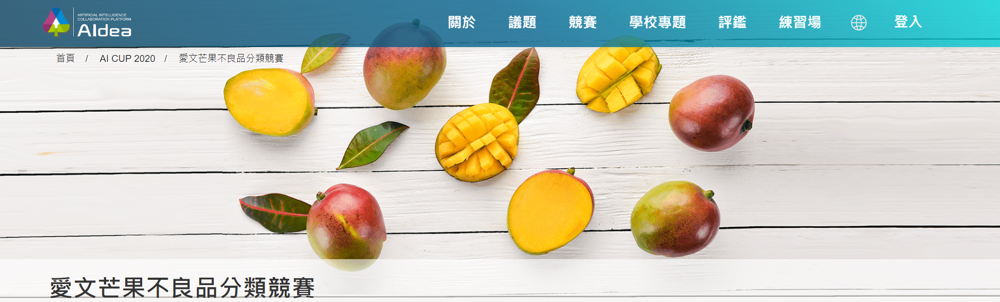
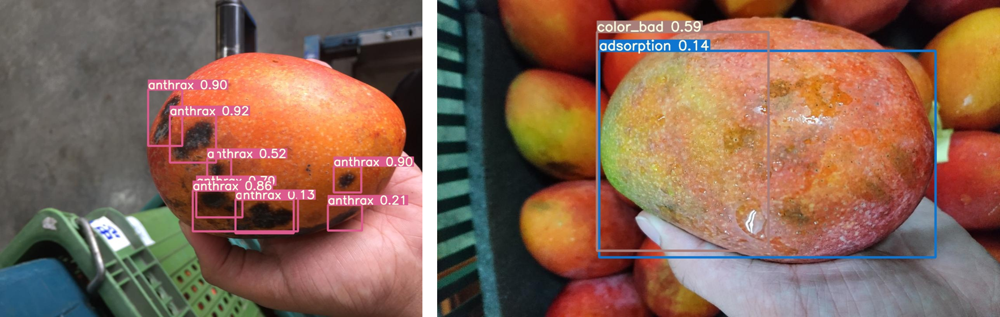

# Competition_2020_Mango_Image_Recognition-Defective_Classification
AI CUP 2020 Mango Image Recognition Challenge: Defective Classification



## Description

**這是參加"[愛文芒果不良品分類競賽](https://aidea-web.tw/topic/fee8b6d6-dbd1-4794-a091-fa2ad829ea14)"的佳作(15/222)紀錄。**

- 此項比賽希望AI圖像識別技術能夠應用於圖像分類，快速識別愛文芒果有缺陷的原因。此外，希望這些數據將來能用於分析和預測，為生產者提供信息，降低芒果的次品率。

- 不良品類別
	- 乳汁吸附(Adsorption)
	- 機械傷害(Mechanical damage)
	- 炭疽病(Anthrax)
	- 著色不佳(Poor coloring)
	- 黑斑病(Black spot)

## Environment

- Windows 10 
- GeForce RTX 3090 GPU
- python3.8.5
- torch>=1.7.0
- torchvision>=0.8.1 

## Installation

- 利用"[YOLOv5](https://github.com/ultralytics/yolov5)"來做物件偵測。

1. Clone this repo:
	```shell
	git clone https://github.com/c221014/Competition_2020_Mango_Image_Recognition-Defective_Classification.git 
	```

2. Create conda virtual environment and activate:
	```shell
	cd "your path"
  	conda create -n Mango_defective python=3.8
  	source activate Mango_defective
	```
	
3. Install torch and torchvision:
	```shell
	pip install torch==1.9.1+cu111 torchvision==0.10.1+cu111 torchaudio==0.9.1 -f https://download.pytorch.org/whl/torch_stable.html
	```
	
4. Install dependencies:
   	```shell
   	pip install -r requirements.txt
	```

## Dataset

**程式碼與相關資料集都在此[google drive](https://drive.google.com/drive/folders/1Y80QSO-BmjAg1w6DNExpaxfzKL5_w1J_?usp=sharing)取得**

1. 訓練資料集在mango_data/txt/images/train2017裡

* 訓練資料 25768 張

2. 測試資料集在mango_data/yolov5_self/data/images裡

* 測試資料 7363 張

資料集取自"[台灣高經濟作物 - 愛文芒果影像辨識正式賽官網](https://aidea-web.tw/aicup_mango)"。

## Train

Run the following command:
  ```
  python train.py --weights yolov5x.pt --batch-size 24 
  ```

## Detect

Run the following command:
  ```
  python detect_modify.py --weights best.pt –conf 0.1 --augment 
  ```
  
## Other Operation

1. yolo_txt_process.py / yolo_txt_process.ipynb →

	是將圖片路徑寫入txt檔以及將圖片的類別和位置資訊以yolov5規定的格式寫入txt檔

2. test_result_label.py / test_result_label.ipynb →

	是將test圖片偵測後輸出的結果轉換為各自包含的不良類別，並將答案填回特定的csv檔案中

## Results



## Reference

- 模型取自 : "[YOLOv5](https://github.com/ultralytics/yolov5)"
- 資料集取自"[台灣高經濟作物 - 愛文芒果影像辨識正式賽官網](https://aidea-web.tw/aicup_mango)"。
